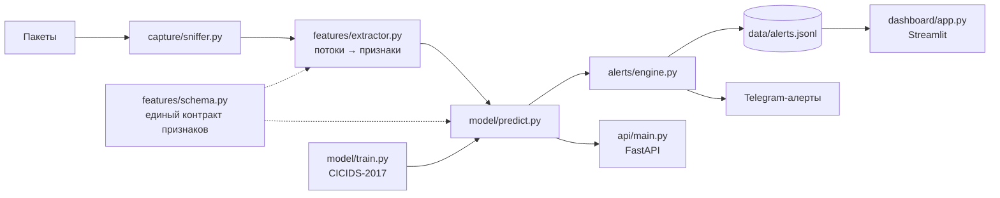

# NIDS — система обнаружения сетевых вторжений


Обнаружение вторжений на основе ML: захватываем сетевые потоки, классифицируем их
моделью, обученной на CICIDS-2017, поднимаем алерты, отдаём API и живой дашборд.

> ⚠️ **Этика / закон:** запускай живой захват только в сетях, которыми владеешь
> или на мониторинг которых у тебя есть явное разрешение. Это защитный /
> образовательный проект.

## Архитектура



Весь пайплайн использует **один** контракт признаков ([features/schema.py](features/schema.py)).
Это исключает классический баг NIDS, когда модель обучена на N признаках, а
обслуживает M.

## Быстрый старт (датасет не нужен)

```bash
cd nids-project
python3 -m venv .venv && source .venv/bin/activate
pip install -r requirements.txt

# 1. Обучение на встроенной синтетике (мгновенно). Бинарно: атака / норма.
python -m model.train

# 2. Какие признаки влияют на решение модели
python -m model.explain

# 3. Поднять API
uvicorn api.main:app
#    проверить:
curl -s localhost:8000/predict -H 'content-type: application/json' \
  -d '{"total_fwd_packets":200,"syn_flag_count":150,"flow_duration":0.1,"fwd_pkt_len_mean":60}'

# 4. Дашборд (читает data/alerts.jsonl)
streamlit run dashboard/app.py
```

## Мультикласс (предсказывать *тип* атаки)

```bash
python -m model.train --multiclass        # классы: BENIGN / PortScan / DoS ...
```

## Обучение на настоящем CICIDS-2017

Скачай CSV с сайта Канадского института кибербезопасности, положи в `data/`, затем:

```bash
python -m model.train --data data/ --multiclass
```

`train.py` чистит кривые имена колонок, исправляет рассинхрон единиц
(микросекунды → секунды у временных признаков) и маппит колонки датасета на
единый контракт.

## Объяснимость и отчёты

```bash
python -m model.explain            # важности признаков (в консоль)
python -m model.explain --shap     # SHAP-график -> reports/shap_summary.png
```

Обучение также автоматически сохраняет `reports/confusion_matrix.png` и (только
для бинарной) `reports/roc_curve.png`. Отключить — флагом `--no-plots`.

## Демо живого дашборда (реальный атакующий трафик не нужен)

Терминал 1 — запустить дашборд:
```bash
streamlit run dashboard/app.py
```
Терминал 2 — стримить синтетические потоки через реальную модель + движок алертов:
```bash
python -m tools.simulate            # Ctrl-C чтобы остановить
```
Дашборд (Живой режим включён) обновляется раз в пару секунд: статус-баннер,
KPI-карточки, таймлайн атак, разбивка по типам и топ source IP оживают по мере
прихода алертов. Сначала обучи мультикласс-модель, чтобы видеть *типы* атак:
```bash
python -m model.train --multiclass
```

## Живой захват

```bash
# macOS
sudo python -m capture.sniffer --iface en0
# Linux
sudo python -m capture.sniffer --iface eth0
```

Потоки завершаются после 15с простоя, оцениваются моделью, и атаки выше порога
уверенности пишутся в `data/alerts.jsonl` (и в Telegram, если настроен).

### Алерты в Telegram (опционально)

```bash
export TELEGRAM_BOT_TOKEN=...   # от @BotFather
export TELEGRAM_CHAT_ID=...
export ALERT_MIN_CONFIDENCE=0.85
```

## Docker

```bash
docker compose up                      # api + dashboard
docker compose --profile capture up    # ещё и сниффер (на Linux-хосте)
```

## Структура

| Путь | Роль |
|------|------|
| `features/schema.py`   | единый источник правды о наборе признаков |
| `features/extractor.py`| пакеты → двунаправленные потоки → векторы признаков |
| `capture/sniffer.py`   | цикл живого захвата на scapy |
| `model/train.py`       | обучение (синтетика или CICIDS), бинарно или мультикласс |
| `model/predict.py`     | обёртка инференса |
| `model/explain.py`     | важности признаков + SHAP |
| `tools/simulate.py`    | симулятор трафика для демо живых алертов |
| `alerts/engine.py`     | порог → консоль / JSONL / Telegram |
| `api/main.py`          | FastAPI `/predict`, `/health` |
| `dashboard/app.py`     | живой дашборд на Streamlit |

